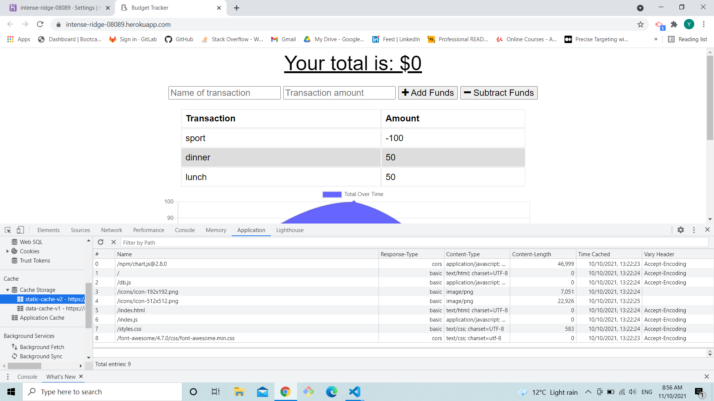

# Unit 19 PWA Homework: Online/Offline Budget Trackers

## Task

Adding offline functionality to an existing app

## URL

https://intense-ridge-08089.herokuapp.com/

## Work

1. when the page is first loaded file are cached with the service worker 

2. when the app goes offline data is saved to indexdb 

3. when the comes back online the app clears the data in the indexdb and is saved to the online data database

